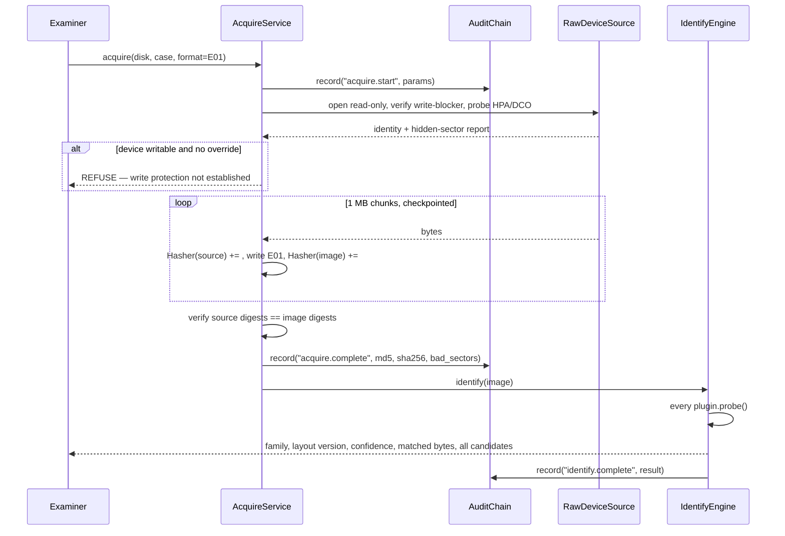
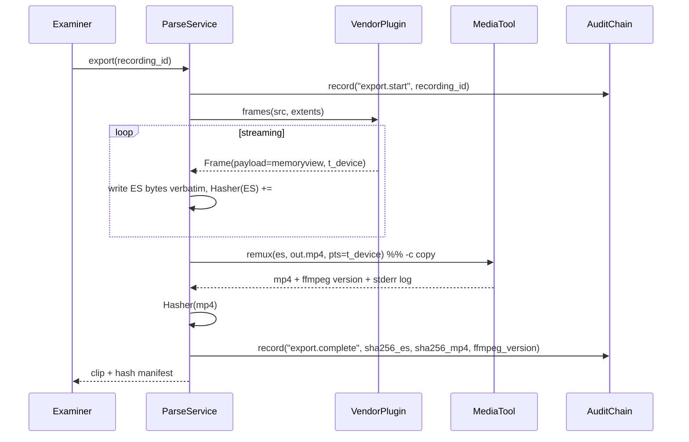
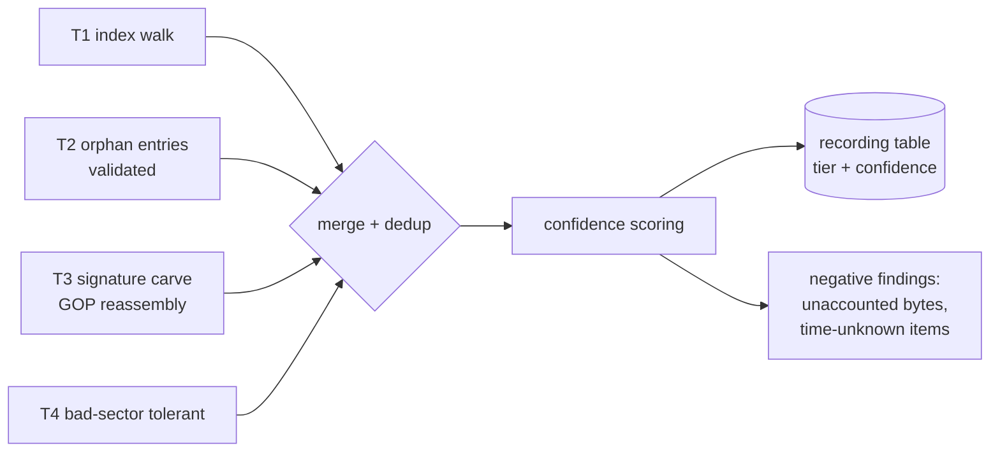

# 03 — System Architecture

**Product:** SPECTRA
**Version:** 1.0 (baseline)
**Depends on:** [doc 1 — Problem Analysis](01-problem-analysis.md), [doc 2 — PRD](02-prd.md)

---

## 1. Architectural drivers

Five constraints determine every structural decision. Everything below follows from these.

| # | Driver | Structural consequence |
|---|---|---|
| D1 | Evidence must never be written to | A single read-only I/O layer that every module goes through. No module opens a file itself. |
| D2 | New vendors must not require core changes | A plugin registry with a narrow, versioned contract. Core knows nothing about any vendor. |
| D3 | Everything must be provable after the fact | One append-only hash-chained audit log that all modules write to synchronously. |
| D4 | Images are 1–48 TB; RAM is 8 GB | Streaming/`mmap` everywhere. No API returns a whole recording as bytes. Extents, not buffers. |
| D5 | No network, ever, during analysis | No services, no daemons, no cloud SDKs. Desktop app + local job runner. Models bundled. |

---

## 2. Layered view

```
┌──────────────────────────────────────────────────────────────────────────────┐
│  PRESENTATION                                                                │
│   spectra.ui (PySide6 desktop)           spectra.cli (Typer)                  │
│   case wizard · timeline · player ·      scriptable, same operations,         │
│   review · report preview                headless, for batch/lab automation   │
└─────────────────────────────────┬────────────────────────────────────────────┘
                                  │  both call the same service API. No logic in the UI.
┌─────────────────────────────────▼────────────────────────────────────────────┐
│  SERVICES  (spectra.services)                                                │
│   CaseService · IdentifyService · AcquireService · ParseService ·             │
│   RecoverService · TimelineService · AnalyticsService · ReportService         │
│   ── each is a thin orchestrator: validate → audit → run job → audit ──       │
└─────────────────────────────────┬────────────────────────────────────────────┘
                                  │
┌─────────────────────────────────▼────────────────────────────────────────────┐
│  DOMAIN ENGINES                                                              │
│  ┌────────────┐ ┌───────────┐ ┌──────────┐ ┌──────────┐ ┌────────┐ ┌───────┐ │
│  │ Identify   │ │ Acquire   │ │ Parse    │ │ Recover  │ │Timeline│ │  ML   │ │
│  │ signature  │ │ imager    │ │ plugin   │ │ T1–T4    │ │ time   │ │motion │ │
│  │ scanner    │ │ verifier  │ │ dispatch │ │ carver   │ │ model  │ │object │ │
│  └────────────┘ └───────────┘ └────┬─────┘ └──────────┘ └────────┘ └───────┘ │
│                                    │                                          │
│                    ┌───────────────▼────────────────┐                         │
│                    │  PLUGIN REGISTRY (D2)          │                         │
│                    │  dahua · hikvision · uniview · │                         │
│                    │  vigi · matrix · generic_fs    │                         │
│                    └────────────────────────────────┘                         │
└─────────────────────────────────┬────────────────────────────────────────────┘
                                  │
┌─────────────────────────────────▼────────────────────────────────────────────┐
│  FOUNDATION  (spectra.core)                                                  │
│   EvidenceSource (read-only I/O, D1)  ·  Hasher (dual MD5/SHA-256)  ·         │
│   AuditChain (D3)  ·  CaseStore (SQLite + CAS)  ·  JobRunner (checkpointed)  ·│
│   MediaTool (pinned FFmpeg wrapper)  ·  Provenance                            │
└──────────────────────────────────────────────────────────────────────────────┘
```

**The one rule that keeps this honest:** UI and CLI are peers over the same service
API. If a capability is only reachable from the GUI, it cannot be scripted, batch-run,
or validated — and validation (doc 6) runs headless.

---

## 3. Foundation layer

### 3.1 `EvidenceSource` — the read-only I/O boundary (D1)

Every byte of evidence in the system is read through one abstraction. There is no
second path.

```python
class EvidenceSource(Protocol):
    """Read-only, seekable, sparse-aware view of an evidence object."""
    size: int
    identity: SourceIdentity          # serial, model, capacity, image format, hashes

    def read(self, offset: int, length: int) -> bytes: ...
    def map(self, offset: int, length: int) -> memoryview: ...   # mmap window, D4
    def readable_ranges(self) -> Iterator[Extent]:  # excludes known-bad sectors
        ...
```

Implementations:

| Implementation | Backs |
|---|---|
| `RawDeviceSource` | `/dev/sdX` or `\\.\PhysicalDriveN`, opened `O_RDONLY` (and `FILE_SHARE_READ` on Windows) |
| `RawImageSource` | `.dd` / `.img`, including split segments (`.001`, `.002`, …) |
| `EwfImageSource` | E01/Ex01 via `pyewf` |
| `Aff4ImageSource` | AFF4 (P2) |
| `FileSetSource` | Loose vendor export files, treated as a concatenated addressable set |

Enforcement, in three places so it is not merely a convention:

1. `EvidenceSource` exposes no write method. There is nothing to call.
2. The OS handle is opened read-only; on Linux, where permitted, the block device is
   additionally set read-only (`BLKROSET`) and the setting is logged.
3. Validation (doc 6, AC-03) runs the full workflow under `strace`/Procmon and asserts
   zero write syscalls against evidence paths. This is the check that actually proves it.

Bad-sector handling lives here: a read that fails is retried per policy, then recorded
in the source's bad-sector map and returned as zero-fill **with the gap recorded**, so
downstream parsers know they are looking at a hole and not at real zeros. Silently
zero-filling without recording is how carvers produce confident garbage.

### 3.2 `Hasher` — dual-digest, single pass

```python
class Hasher:
    """MD5 + SHA-256 over one pass. MD5 is for legacy cross-referencing only."""
    def update(self, data: bytes) -> None: ...
    def digests(self) -> Digests:   # {"md5": ..., "sha256": ...}
```

Policy (doc 1 §4.7): hashes are taken at four points — source device, acquired image,
each extracted artefact, each generated report — and every one lands in the case DB and
the report's hash table. SHA-256 is the integrity assertion; MD5 exists because Indian
departmental records and the BSA certificate format still reference it. The report says
this in words, so nobody defends MD5 on the stand.

### 3.3 `AuditChain` — tamper-evident history (D3)

Append-only, hash-linked. Written **synchronously before and after** every
state-changing operation, so a crash mid-operation leaves a "started, not completed"
record rather than a silent hole.

```python
@dataclass(frozen=True)
class AuditRecord:
    seq: int
    ts_utc: str                 # RFC 3339, always UTC, always from a monotonic-checked clock
    operator: str               # authenticated user
    action: str                 # "acquire.start", "parse.complete", "export.clip", ...
    target: str | None          # object id
    params: dict                # canonicalised
    result: str                 # "ok" | "error" | "started"
    hash_before: str | None
    hash_after: str | None
    prev_digest: str            # SHA-256 of the previous record
    # digest = sha256(canonical_json(record without this field))
```

`verify()` walks from seq 0 and recomputes. Any insertion, deletion, reordering, or
field edit breaks the link at that point and is located precisely. The head digest is
printed in the report (FR-82) with the commands a third party can run to re-verify
(FR-85).

Canonicalisation matters: JSON with sorted keys, no whitespace, UTF-8, and a fixed
float representation. Otherwise two correct implementations disagree on the digest and
the whole mechanism is worthless.

### 3.4 `CaseStore` — SQLite + content-addressed store

One directory per case; portable; no server.

```
CASE-2026-0142/
├── case.db                 # SQLite (WAL), the schema in §11
├── artifacts/              # content-addressed by SHA-256
│   └── ab/cd/abcdef…       # extracted clips, ES dumps, report PDFs, attachments
├── images/                 # acquired images (or symlinks to external storage)
├── logs/                   # tool logs, FFmpeg transcripts, protocol transcripts
└── case.manifest.json      # head digest, tool versions, integrity summary
```

Content-addressing gives deduplication and makes "is this the same file?" a hash
comparison rather than a path comparison — useful when the same clip is exported twice.

### 3.5 `JobRunner` — checkpointed long operations (NFR-09)

Acquisition, carving, and analytics all run for hours over terabytes. Each is a `Job`
with `run(checkpoint) -> progress` semantics; checkpoints persist to the case DB every
N seconds or M bytes. A killed 90 %-complete 12 TB carve resumes at 90 %.

Jobs run in worker processes (not threads — the carve is CPU-bound and the GIL is real),
communicating progress over a queue. The UI polls; the CLI prints.

### 3.6 `MediaTool` — the pinned FFmpeg wrapper

FFmpeg is invoked as a subprocess with a **pinned, bundled build**, and its exact
version string is recorded in the case DB and printed in the report (FR-84). Two modes,
never confused:

- `remux(es_path, out_mp4, timestamps)` → `-c copy`. **Evidence copy.** Payload
  bit-identical.
- `derive(...)` → re-encode. **Derivative copy.** Watermarked in metadata as derivative
  and labelled as such everywhere it appears.

Every invocation's full command line and stderr go to `logs/` and are hashed.

---

## 4. The plugin contract

The core of the "vendor-agnostic" claim (D2). This is the interface; a vendor is one
file implementing it, plus one registry line.

```python
class VendorPlugin(Protocol):
    family: str                    # "dahua", "hikvision", "uniview", ...
    layout_versions: list[str]     # on-disk format versions this module understands
    plugin_version: str            # recorded in the report for reproducibility

    # ── Q1: is this disk mine, and how sure am I? ──────────────────────────
    @classmethod
    def probe(cls, src: EvidenceSource) -> ProbeResult | None:
        """Read a bounded number of bytes at known offsets. Return family,
        layout version, confidence 0..1, and the exact matched bytes+offsets
        for display (FR-02). Return None if not this family.
        MUST NOT guess: an unknown layout version returns confidence but sets
        `parse_supported=False` so the core routes to carving (FR-03)."""

    # ── Q2: what is the disk's shape? ──────────────────────────────────────
    def superblock(self, src: EvidenceSource) -> DiskLayout:
        """block_size, block_count, index extents, log extents, format time."""

    # ── Q3: what recordings does the index claim? ──────────────────────────
    def enumerate(self, src: EvidenceSource, layout: DiskLayout,
                  include_orphans: bool) -> Iterator[Recording]:
        """T1 when include_orphans=False; T1+T2 when True (FR-40, FR-41).
        Yields the NORMALISED Recording record — identical schema for every
        vendor (FR-28). Streams; never materialises the full set."""

    # ── Q4: how do I get frames out of a data block? ───────────────────────
    def frames(self, src: EvidenceSource, extent: Extent) -> Iterator[Frame]:
        """Parse the vendor frame container. Yields Frame with the payload as a
        memoryview into the mapped source (D4) — NOT a copy — plus frame type,
        channel, t_device, and codec hints."""

    # ── Carving support (T3) ───────────────────────────────────────────────
    def carve_signatures(self) -> list[Signature]:
        """Byte patterns that mark a frame/GOP start for this family, with a
        validator callback that rejects false positives (FR-42)."""

    # ── Time semantics ─────────────────────────────────────────────────────
    def decode_time(self, raw: bytes | int, layout: DiskLayout) -> DeviceTime:
        """Vendor timestamp encoding → t_device. Unit-tested against known-good
        vectors for every supported layout version (FR-54, NFR-12)."""

    # ── Optional ───────────────────────────────────────────────────────────
    def system_log(self, src, layout) -> Iterator[DeviceEvent]: ...   # FR-07
    def firmware_facts(self, fw: EvidenceSource) -> FirmwareFacts: ...# FR-05
```

Normalised types shared by all plugins:

```python
@dataclass
class Recording:                     # FR-28 — vendor-independent
    channel: int
    stream: Literal["main", "sub"]
    t_start: DeviceTime
    t_end: DeviceTime
    extents: list[Extent]            # physical byte ranges — no payload here (D4)
    codec: str                       # "h264" | "h265" | "mjpeg" | "unknown"
    resolution: tuple[int, int] | None
    fps: float | None
    size_bytes: int
    recovery_tier: Literal["T1", "T2", "T3", "T4"]
    confidence: float                # 0..1
    source_note: str                 # how this was found, for the report

@dataclass
class Frame:
    kind: Literal["I", "P", "B", "audio", "unknown"]
    channel: int | None
    t_device: DeviceTime | None
    payload: memoryview              # a window into the source, not a copy
    codec_hint: str | None
```

### 4.1 Plugin dispatch

```python
def select_plugin(src) -> tuple[VendorPlugin, ProbeResult]:
    results = [(p, p.probe(src)) for p in REGISTRY]
    results = [(p, r) for p, r in results if r]
    if not results:
        return GenericFsPlugin, ProbeResult(family="unknown", confidence=0.0)
    plugin, best = max(results, key=lambda pr: pr[1].confidence)
    if len(results) > 1:
        audit("identify.ambiguous", candidates=[r.family for _, r in results])
    return plugin, best
```

Ambiguity is **surfaced, not resolved silently** — the operator sees every candidate
with its confidence and matched bytes, and can override. An override is an audit record.

### 4.2 Adding a vendor (the P4 journey, AC-12)

1. `tools/dump_signature.py IMAGE` → hexdump of first/last 1 MB, entropy map, repeated-
   structure and periodicity analysis (FR-09).
2. Identify the superblock and index layout; write `plugins/newvendor.py` implementing
   the six required methods.
3. Add a fixture image to `tests/corpus/` with a ground-truth JSON.
4. Add one line to `REGISTRY`.
5. `pytest tests/test_plugins.py -k newvendor` — the same generic conformance suite
   runs against every plugin.

No core file is edited. AC-12 verifies this by inspecting the diff scope.

---

## 5. Acquisition engine

```
                   ┌───────────────────────────────────────────┐
   attached disk ──▶ pre-flight                                │
                   │  · write-blocker verification (FR-12)     │
                   │  · HPA/DCO detection (FR-13)              │
                   │  · SMART read, drive identity             │
                   └───────────────┬───────────────────────────┘
                                   ▼
                   ┌───────────────────────────────────────────┐
                   │ imaging loop (checkpointed, resumable)    │
                   │  read 1 MB ─┬─▶ Hasher(source)            │
                   │             ├─▶ writer: raw | E01         │
                   │             └─▶ Hasher(image)             │
                   │  on read error: retry → log LBA → zero-fill│
                   └───────────────┬───────────────────────────┘
                                   ▼
                   ┌───────────────────────────────────────────┐
                   │ verification: source digests == image      │
                   │ digests; bad-sector map persisted          │
                   └───────────────────────────────────────────┘
```

**Write-blocker verification (FR-12)** is done by capability, not by trust: attempt a
zero-length write to the device handle in a way the OS will reject harmlessly, confirm
`EROFS`/`ACCESS_DENIED`, and separately read the blocker's identification where the
hardware exposes it. If the device is provably writable, the tool refuses and requires
an explicit logged override that downgrades the provenance class from A to B (FR-19).

**Provenance classes (FR-19)** propagate from here to the report and are the single
honest statement of evidential weight:

| Class | Meaning | Report language |
|---|---|---|
| A | Physical image, hardware write-blocked | Strongest. Bit-for-bit, verifiably unaltered. |
| B | Physical image, no write blocker, justified | Physical image; write protection was by [method]; justification recorded. |
| C | Live logical acquisition | Logical extract from a running device; source could not be independently verified at acquisition time. |
| D | Third-party export | Received as vendor export files; the original storage was not examined. |

**Live logical acquisition (FR-16)** speaks the vendor's own retrieval interface or
ONVIF Profile G, streams the requested channel/time window to disk while hashing, and
writes a complete protocol transcript to `logs/`. It never issues a configuration
change, a PTZ command, or a delete.

---

## 6. Parsing pipeline

```
EvidenceSource
   │
   ├─▶ IdentifyEngine ──▶ ProbeResult {family, layout_version, confidence, matched bytes}
   │                              │
   │                              ├─ parse_supported? ──no──▶ carving mode only (FR-03)
   │                              ▼ yes
   ├─▶ plugin.superblock()  ──▶ DiskLayout
   │
   ├─▶ plugin.enumerate()   ──▶ Recording[]  (T1, +T2 if requested)  ──▶ case.db
   │
   ├─▶ CoverageMap: which bytes are accounted for?  (FR-29)
   │      parsed | carved | unreadable | UNACCOUNTED  ← this last one is a finding
   │
   └─▶ on export of a Recording:
          plugin.frames(extent)          # vendor headers stripped, payload untouched
            → ES writer (Annex-B / HEVC) → Hasher  → artifacts/  (FR-32)
            → MediaTool.remux(-c copy)   → Hasher  → artifacts/  (FR-31, FR-32)
            → per-frame t_device applied as PTS               (FR-33)
```

### 6.1 Why extents and not buffers (D4)

`Recording.extents` are byte ranges, not data. A 4-hour 4 MP recording is ~30 GB; it is
never in memory. `plugin.frames()` maps a window at a time and yields `memoryview`s.
The ES writer streams to disk. Peak RSS stays under the NFR-04 ceiling regardless of
recording length or image size.

### 6.2 The coverage map (FR-29) — a first-class output

After parsing, every byte of the image is in exactly one bucket:

| Bucket | Meaning |
|---|---|
| `parsed` | Claimed by a T1/T2 recording |
| `carved` | Recovered at T3/T4 |
| `structural` | Superblock, index, logs — understood metadata |
| `unreadable` | Bad sectors |
| `unaccounted` | **Bytes the tool could not explain.** Non-zero entropy here means data we did not recover. |

`unaccounted` with high entropy is a red flag the examiner must see, and it goes
straight into the negative-findings section (FR-81). A tool that does not compute this
cannot honestly say what it missed.

### 6.3 Container decoding (FR-30..FR-36)

The payload rule, stated once and enforced by test AC-05:

```
bytes in the data block  ──strip vendor frame header──▶  ES bytes
                                                          │
                                  sha256(ES) recorded ─────┤
                                                          ▼
                                              MP4 (-c copy) — payload identical
```

Vendor codec variants (Hikvision H.264+, Dahua Smart H.264/H.265+) are detected from
SPS/PPS and vendor SEI. Where a variant is not reliably decodable by the bundled
FFmpeg, the tool **detects it, extracts the ES anyway (it is still evidence), and
reports the limitation** rather than emitting visually corrupt output and calling it a
success (FR-35).

---

## 7. Recovery engine

Four tiers (doc 1 §4.4), run in order, merged and deduplicated (FR-44).

```
T1  index walk           ──┐
T2  orphan index walk    ──┤
                           ├──▶ merge + dedup (by extent overlap + content hash)
T3  signature carve      ──┤       keep highest tier; record that a duplicate existed
T4  bad-sector-tolerant  ──┘
```

### 7.1 T2 — orphan index entries

Plugins expose entries whose in-use flag is clear. For each, the engine **validates
before trusting**: does the referenced data block still begin with the family's frame
magic? Do the frame-header timestamps fall inside the entry's claimed window? Does the
channel in the frame headers match the entry's channel? All three must hold, or the
entry is downgraded to a carve candidate. This validation is what stops T2 from
reporting stale index entries pointing at freshly overwritten blocks — the single most
likely way to produce a confidently wrong recovery.

### 7.2 T3 — signature carve

```python
for window in src.stream(chunk=64 * 1024 * 1024, overlap=MAX_FRAME_HEADER):
    for sig in plugin.carve_signatures():          # e.g. b"DHAV", b"\x00\x00\x01\xBA"
        for hit in find_all(window, sig.pattern):
            if not sig.validate(window, hit):      # reject false positives
                continue
            emit_candidate(absolute_offset(hit), sig)
```

Then GOP reassembly: from each validated hit, walk forward through the frame chain
until a discontinuity; require the run to start at an I-frame (a run starting mid-GOP
is unplayable and is trimmed to the first I-frame); emit as a `Recording` at T3 with
channel and `t_device` taken from the frame headers where the format carries them.

Overlap of `MAX_FRAME_HEADER` between chunks is what keeps a signature straddling a
chunk boundary from being missed — the classic carving bug.

**Confidence scoring for T3 items:**

| Evidence available | Confidence |
|---|---|
| Frame headers with channel + timestamp, ≥ 2 consecutive GOPs, timestamps monotonic | 0.9 |
| Frame headers with timestamp but no channel | 0.7 |
| Valid GOP structure, no recoverable timestamp | 0.4 — **presented as "time unknown"** (FR-45, FR-53) |
| Single fragment, decodes but no chain | 0.2 |

A 0.4-confidence item is never given a synthesised time. It is placed in physical order
with an explicit "time not recoverable" label. This is the rule that keeps the tool
honest under cross-examination.

### 7.3 T4 — bad-sector tolerant

Re-runs T3 using `readable_ranges()`, treating each unreadable run as a hard boundary
and emitting each survivable contiguous span as its own clip, with the gap positions
recorded. Produces many small clips; that is correct — the alternative is one long clip
with invisible corruption in the middle.

---

## 8. Timeline engine

### 8.1 The time model (FR-50..FR-53)

```python
@dataclass(frozen=True)
class DeviceTime:
    raw: int | bytes                # exactly as stored — never discarded
    encoding: str                   # "unix_le32" | "packed_bcd_v2" | ...
    local: datetime | None          # decoded wall clock as the device believed it

@dataclass(frozen=True)
class ReferenceTime:
    utc: datetime | None            # None when offset is undetermined (FR-53)
    uncertainty_s: float            # ALWAYS present
    method: Literal["A_ntp", "B_reference_capture", "C_external_event",
                    "D_live_rtc", "none"]
    tz_offset_s: int
    clock_offset_s: float
    derivation_note: str            # printed verbatim in the report
```

`ReferenceTime.utc is None` is a legal, expected state, and the UI and report handle it
by showing device-local time with a prominent "absolute time not established" banner.
The tool never fills it in. This single design choice removes the most common attack on
CCTV evidence: an unexplained, unverified absolute timestamp.

Uncertainty propagates: correlating two devices with ±1 s and ±30 s offsets yields a
±31 s window on the relative ordering, and the timeline draws it that way. An ordering
assertion that is not safe at the stated uncertainty is not made.

### 8.2 Offset determination (FR-51)

The four methods of doc 1 §4.5, ranked A > B > C > D. Method B (reference-object
capture at seizure) is a *procedural* input: the examiner enters the true UTC of the
capture and marks the frame in which the reference clock is legible; the tool computes
the offset and records both the frame reference and the operator's assertion in the
audit log. Fifteen seconds at the scene, and the strongest available offset when NTP
was not configured.

### 8.3 Correlation (FR-57..FR-62)

Once every recording carries a `ReferenceTime`, correlation is a join on one axis.

```
t_reference ────────────────────────────────────────────────────────▶
DEV-1 ch01 ████████████░░░░░░░████████████████  ░ = gap (FR-58)
DEV-1 ch02 █████████████████████████████████████
DEV-1 ch05 ███████░░░░░░░░░░░░░░░░░░░░░████████  ← 4 h gap: FINDING
DEV-2 ch03 ▓▓▓▓▓▓▓▓▓▓▓▓▓▓▓▓▓▓▓▓▓▓▓  ±30 s        ▓ = other device, wider uncertainty
           ▲          ▲     ▲
           motion     object hit   bookmark
```

- **Gap analysis (FR-58)** treats absence as a finding, per channel and globally. A
  synchronised gap across all channels is evidence of a power event or deliberate
  interruption and is called out explicitly.
- **Synchronised playback (FR-59)** seeks by `t_reference`, applying each device's
  offset — so the four panes actually show the same moment, which no vendor player does.
- **Entity threading (FR-61)** clusters analytics embeddings into candidate tracks,
  ranked, always labelled as leads (§9).

---

## 9. Analytics subsystem

```
Recording (evidence, read-only)
   │  decode to frames — into memory only, never written back
   ▼
┌──────────────────────────────────────────────────────────────┐
│  Stage 1: MOTION  (OpenCV, no ML)                            │
│   frame differencing + region mask → activity segments        │
│   ── this is the 80 % time-saving. Run it first, always. ──   │
└───────────────────────┬──────────────────────────────────────┘
                        │ only motion segments proceed (cost control)
┌───────────────────────▼──────────────────────────────────────┐
│  Stage 2: OBJECTS  (ONNX Runtime, pinned model)              │
│   person / vehicle / two-wheeler / bag + confidence           │
└───────────────────────┬──────────────────────────────────────┘
┌───────────────────────▼──────────────────────────────────────┐
│  Stage 3: FACE DETECT + CLUSTER · ANPR · ReID  (P1/P2)       │
│   detection and clustering only — NO watchlist, NO identity DB│
└───────────────────────┬──────────────────────────────────────┘
                        ▼
   Annotations  {frame_no, t_reference, bbox, label, score,
                 model_name, model_sha256, disclaimer}
                 stored ALONGSIDE evidence, never inside it (FR-97)
```

Three hard constraints, structural rather than policy:

1. **No egress (FR-95).** The analytics worker process runs with networking disabled
   (Linux: a network namespace with only loopback; Windows: a firewall rule scoped to
   the process). It is not "we don't call the internet" — it *cannot*.
2. **Pinned models (FR-84, FR-96).** Model file SHA-256 is recorded in the case DB and
   printed in the report. A result from 2026 is reproducible in 2031 given the same
   model file.
3. **Lead-only framing (FR-96).** Every annotation carries a fixed disclaimer string
   that the report renders verbatim next to every hit:
   *"Machine-generated detection. Confidence <s>. Requires human verification against
   the source frame. Not an identification."*

Stage 1 before stage 2 is not just an optimisation — running a detector over 720 hours
of empty corridor is the single biggest waste of compute in this domain, and motion
gating removes 90–99 % of it.

---

## 10. Reporting engine

```
case.db + artifacts + audit chain
   │
   ├─▶ findings.json   (FR-86) — machine-readable, deterministic (NFR-08)
   │
   └─▶ Jinja2 template ─▶ HTML ─▶ WeasyPrint ─▶ PDF/A
          ├─ §1–§6   case, evidence, acquisition, identification, FS, recordings
          ├─ §7      NEGATIVE FINDINGS  ← auto-populated, mandatory, non-skippable
          ├─ §8      timestamp analysis: model, method, uncertainty, derivation note
          ├─ §9      timeline & correlation
          ├─ §10     analytics — every hit with model hash + disclaimer
          ├─ §11     integrity: full hash table, audit head digest, verify commands
          └─ §12     appendices + Annexure: BSA s. 63(4) certificate (FR-83)
```

**§7 is generated, not written.** It draws from the coverage map's `unaccounted` bucket,
the bad-sector map, unparsed structure versions, channels with zero recordings, and
timeline gaps. The examiner can add to it; the examiner cannot delete from it. That
constraint is the difference between a forensic report and marketing output.

**Determinism (NFR-08, AC-11).** Report generation sorts everything, uses a fixed
locale and UTC, and takes timestamps of *the analysis* from recorded audit records
rather than from `now()`. Two runs produce identical `findings.json`.

---

## 11. Data model

```sql
-- Identity and authority
CREATE TABLE case_meta (
  case_id TEXT PRIMARY KEY, title TEXT, agency TEXT, fir_ref TEXT,
  authority_ref TEXT, examiner_name TEXT, examiner_designation TEXT,
  examiner_s79a_ref TEXT, created_utc TEXT
);

CREATE TABLE evidence (
  id TEXT PRIMARY KEY, case_id TEXT REFERENCES case_meta,
  kind TEXT,                       -- 'disk' | 'image' | 'export_files' | 'firmware' | 'document'
  provenance_class TEXT,           -- 'A' | 'B' | 'C' | 'D'          (FR-19)
  label TEXT, device_make TEXT, device_model TEXT, device_serial TEXT,
  disk_make TEXT, disk_model TEXT, disk_serial TEXT, capacity_bytes INTEGER,
  hpa_present INTEGER, dco_present INTEGER, hidden_sectors INTEGER,
  md5 TEXT, sha256 TEXT, acquired_utc TEXT, acquired_by TEXT,
  write_blocker TEXT, notes TEXT
);

CREATE TABLE identification (
  evidence_id TEXT REFERENCES evidence,
  family TEXT, layout_version TEXT, confidence REAL,
  parse_supported INTEGER, matched_signature_hex TEXT, matched_offsets TEXT,
  candidates_json TEXT,            -- all probe results, for FR-02 transparency
  brand_inferred TEXT, brand_evidence TEXT
);

CREATE TABLE disk_layout (
  evidence_id TEXT REFERENCES evidence,
  block_size INTEGER, block_count INTEGER, blocks_used INTEGER,
  index_extents_json TEXT, log_extents_json TEXT, format_utc TEXT
);

-- The normalised, vendor-independent recording record (FR-28)
CREATE TABLE recording (
  id TEXT PRIMARY KEY, evidence_id TEXT REFERENCES evidence,
  channel INTEGER, channel_name TEXT,      -- name from firmware, if available
  stream TEXT, codec TEXT, width INTEGER, height INTEGER, fps REAL,
  t_device_raw TEXT, t_device_encoding TEXT,
  t_local_start TEXT, t_local_end TEXT,
  t_ref_start TEXT, t_ref_end TEXT, t_uncertainty_s REAL, t_method TEXT,
  extents_json TEXT, size_bytes INTEGER,
  recovery_tier TEXT, confidence REAL, source_note TEXT
);

CREATE TABLE artifact (                    -- exported clips, ES dumps, reports
  sha256 TEXT PRIMARY KEY, md5 TEXT, path TEXT, kind TEXT,
  recording_id TEXT REFERENCES recording, is_derivative INTEGER,
  created_utc TEXT, tool_versions_json TEXT
);

CREATE TABLE coverage (                    -- FR-29
  evidence_id TEXT, offset INTEGER, length INTEGER,
  bucket TEXT                              -- parsed|carved|structural|unreadable|unaccounted
);

CREATE TABLE device_event (                -- FR-07 device system log
  evidence_id TEXT, t_device TEXT, t_ref TEXT, kind TEXT, detail TEXT
);

CREATE TABLE annotation (                  -- FR-97 analytics + human bookmarks
  id TEXT PRIMARY KEY, recording_id TEXT REFERENCES recording,
  frame_no INTEGER, t_ref TEXT, bbox_json TEXT, label TEXT, score REAL,
  source TEXT,                             -- 'motion'|'object'|'face'|'anpr'|'human'
  model_name TEXT, model_sha256 TEXT, note TEXT
);

CREATE TABLE custody (                     -- FR-73
  seq INTEGER PRIMARY KEY, evidence_id TEXT, ts_utc TEXT,
  from_holder TEXT, to_holder TEXT, purpose TEXT, signature_ref TEXT
);

CREATE TABLE audit (                       -- FR-71, append-only, hash-chained
  seq INTEGER PRIMARY KEY, ts_utc TEXT, operator TEXT, action TEXT,
  target TEXT, params_json TEXT, result TEXT,
  hash_before TEXT, hash_after TEXT, prev_digest TEXT, digest TEXT
);
```

`audit` is protected by triggers that raise on `UPDATE` and `DELETE`. That stops
accidents; it does not stop a determined party with sqlite3 — which is precisely why
the hash chain exists and why the head digest is published in the report.

---

## 12. Key sequences

### 12.1 Acquire and identify



### 12.2 Export an evidence clip



### 12.3 Recovery merge



---

## 13. Technology stack

| Concern | Choice | Note |
|---|---|---|
| Language | Python 3.11+ | Parsers are I/O-bound; drop to Rust/Cython only if the T3 carve profiles badly |
| Binary parsing | `struct`, `mmap` | Stdlib does it |
| E01 | `libewf` / `pyewf` | Lab exchange format |
| Hashing | `hashlib` | Dual digest, one pass |
| Video | Bundled pinned **FFmpeg** | `-c copy` for evidence; version in report |
| DB | SQLite (WAL) | One portable file per case |
| Analytics | ONNX Runtime + OpenCV | CPU-first, GPU optional, offline |
| GUI | PySide6 / Qt | Offline desktop is the correct shape for an evidence machine |
| Report | Jinja2 → WeasyPrint → PDF/A | Deterministic, archival |
| Packaging | PyInstaller + offline wheelhouse | Air-gapped install |
| Tests | pytest + synthetic corpus | doc 6 |

---

## 14. Security and deployment

**Deployment.** Single desktop install on the examiner's workstation. No server, no
daemon, no listening socket. Evidence storage is local or on a lab SAN mounted
read-only. Case containers are portable directories.

**Privileges.** Raw device read requires elevation on both platforms; nothing else does.
The application drops to unprivileged operation immediately after opening the device
handle.

**At rest.** The case container is optionally encrypted (AES-256-GCM, key from the
examiner's credential or an agency HSM/smartcard). Artefacts are content-addressed, so
encryption is at the container level.

**Access control.** Roles: `examiner` (full), `reviewer` (read + annotate + no export),
`readonly`. Every media access is an audit record (FR-76).

**Supply chain.** Pinned dependency hashes, an SBOM shipped with each release, and
reproducible builds where the toolchain allows. For an NTRO-context tool this is not
optional hygiene — a forensic tool that cannot account for its own binary provenance
cannot credibly assert anyone else's.

**Threat model, briefly.** The adversary is not a network attacker (there is no
network); it is (a) an examiner who makes an undetected mistake, (b) a party who wants
to alter findings after the fact, and (c) a defence expert looking for undisclosed
gaps. The architecture answers these with, respectively: the read-only layer plus
coverage map, the hash chain, and mandatory negative findings.

---

## 15. Directory structure

```
spectra/
├── core/
│   ├── source.py        # EvidenceSource + implementations (D1)
│   ├── hashing.py       # Hasher
│   ├── audit.py         # AuditChain
│   ├── casestore.py     # SQLite + CAS
│   ├── jobs.py          # JobRunner, checkpointing
│   ├── media.py         # MediaTool (pinned FFmpeg)
│   └── models.py        # Recording, Frame, DeviceTime, ReferenceTime, Extent
├── identify/
│   ├── engine.py        # probe dispatch, confidence, ambiguity surfacing
│   └── dossier.py       # FR-09 unknown-format dossier
├── acquire/
│   ├── imager.py        # raw/E01, checkpointed
│   ├── blocker.py       # write-blocker verification
│   ├── hpa_dco.py
│   └── live.py          # FR-16 live logical
├── plugins/
│   ├── base.py          # THE CONTRACT (§4)
│   ├── registry.py
│   ├── dahua.py         # + CP Plus, Dahua-ODM Godrej/Honeywell
│   ├── hikvision.py
│   ├── uniview.py
│   ├── tplink_vigi.py
│   ├── matrix.py
│   ├── honeywell.py
│   └── generic_fs.py    # ext2/3/4, FAT/exFAT, XFS fallback
├── recover/
│   ├── orphans.py       # T2 + validation
│   ├── carver.py        # T3 chunked scan with overlap
│   ├── gop.py           # reassembly
│   └── merge.py         # dedup + confidence
├── timeline/
│   ├── timemodel.py     # three-layer model
│   ├── offset.py        # methods A–D
│   ├── correlate.py     # cross-channel, cross-device
│   └── gaps.py          # FR-58
├── ml/
│   ├── motion.py        # stage 1 — run first, always
│   ├── objects.py       # ONNX
│   ├── faces.py         # detect + cluster only
│   └── sandbox.py       # network-namespace isolation (FR-95)
├── report/
│   ├── generator.py
│   ├── findings.py      # deterministic findings.json
│   ├── negative.py      # FR-81, auto-populated
│   └── templates/
│       ├── report.html.j2
│       └── bsa_63_4_certificate.html.j2    # FR-83
├── services/            # thin orchestrators, the API for UI and CLI
├── ui/                  # PySide6
└── cli.py               # Typer

tools/
├── dump_signature.py    # FR-09 — bootstrap a new plugin
└── make_corpus.py       # doc 6 §3 — synthetic ground-truth images

tests/
├── corpus/              # fixtures + ground-truth JSON
├── test_plugins.py      # generic conformance suite, runs against EVERY plugin
├── test_timestamps.py   # known-good vectors per vendor per layout version
└── test_audit.py        # tamper-detection trials
```

---

## 16. Design decisions worth defending

| Decision | Alternative rejected | Why |
|---|---|---|
| Format family drives plugin choice; brand is cosmetic | Brand-keyed parsers | The plastic says CP Plus, the disk says Dahua. Keying on brand breaks on every rebrand — and rebrands are most of the market |
| Extents, not buffers, in the Recording record | Return decoded video | 30 GB recordings on an 8 GB machine (D4) |
| Remux `-c copy` for evidence; transcode only as a labelled derivative | Always transcode for compatibility | A transcoded file is not the evidence, and saying it is loses the case |
| `ReferenceTime.utc` may legitimately be `None` | Always produce a timestamp | A fabricated absolute time is the most attackable thing in a CCTV report |
| Negative findings auto-generated and non-deletable | Examiner writes the caveats | The tool knows what it failed to read; the examiner may not |
| Analytics in a network-isolated process | Trust the code not to call out | "Cannot" beats "does not" when evidence is involved |
| Desktop app, no server | Web UI | Evidence workstations are air-gapped; a server implies a network |
| SQLite per case | Central database | Portability, court exhibits, no infrastructure in a district cyber cell |
| MD5 computed but SHA-256 asserted | SHA-256 only | BSA certificate practice and legacy records still cite MD5; computing it costs nothing and its role is stated explicitly |
